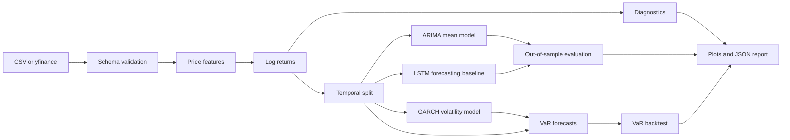

# Financial Time Series Analysis

An end-to-end, reproducible research pipeline for financial time-series analysis. The project studies daily equity prices and log returns through classical econometrics, volatility modeling, risk estimation, neural forecasting, and out-of-sample evaluation.

The primary workflow uses the latest **ten years of Apple (`AAPL`) daily data**, resolved at runtime so the window stays current. The pipeline also accepts any local CSV containing a date column and a `Close`, `Adj Close`, or `Price` column.

> **Important:** This repository is an educational and engineering project. It is not financial advice, an investment recommendation, or a trading system.

## What the project demonstrates

- reliable price-data ingestion from a local CSV or `yfinance`;
- log-return and annualized rolling-volatility feature engineering;
- stationarity testing with the Augmented Dickey-Fuller test;
- ACF, PACF, Ljung-Box, distribution, skewness, and kurtosis diagnostics;
- ARIMA order selection by AIC and out-of-sample return forecasting;
- GARCH(1,1) volatility estimation, with the `arch` package as the primary backend and a SciPy maximum-likelihood fallback;
- historical, parametric, and GARCH-based Value at Risk (VaR);
- VaR exception counting and Kupiec unconditional-coverage testing;
- an LSTM return-forecasting baseline implemented in PyTorch;
- temporal train/test splitting to prevent look-ahead bias;
- reproducible CSV, JSON, metric, and PNG artifacts;
- automated tests and Docker support.

## Architecture



## Methodological choices

### Prices and returns

The pipeline models log returns rather than raw prices:

```text
r_t = log(P_t) - log(P_{t-1})
```

This avoids treating a non-stationary price level as a stationary signal. The price level is retained for visualization, while the models operate on the return series.

### ARIMA

The implementation searches over a small ARIMA `(p, 0, q)` grid and selects the candidate with the lowest AIC on the training set. It then generates a multi-step forecast for the untouched test period.

### GARCH

The volatility model is a GARCH(1,1) process. Returns are internally scaled to percentage points during estimation to improve numerical conditioning and are converted back to decimal returns and volatility in the public result.

If `arch` is installed, it is used with a constant mean and Student-t innovations. When `arch` is unavailable, the project uses a transparent SciPy maximum-likelihood implementation of a Gaussian GARCH(1,1) process. The report records which backend was used.

### Value at Risk

VaR is reported as a positive loss threshold:

- **Historical VaR:** empirical lower-tail quantile;
- **Parametric VaR:** normal mean/volatility approximation;
- **GARCH VaR:** conditional volatility forecast combined with a normal quantile.

The project evaluates VaR forecasts on the held-out period and reports observed exceptions, expected exceptions, and the Kupiec likelihood-ratio test. A small number of test observations can make coverage tests statistically weak, so use a longer historical dataset for meaningful conclusions.

### LSTM

The LSTM is an explicitly labeled forecasting baseline. It uses a rolling window of past returns, standardizes the training series only, and recursively generates the test-horizon forecast. It is not presented as proof that neural networks outperform econometric models.

## Quickstart

```bash
python -m venv .venv
source .venv/bin/activate
python -m pip install -e ".[full]"
python -m pytest -q
```

Run the offline demo with the included sample data:

```bash
python -m financial_time_series.cli run \
  --data data/raw/aapl_smoke_fixture.csv \
  --output artifacts/demo \
  --lstm-window 10 \
  --lstm-epochs 5
```

The included CSV contains only 41 price observations and is a smoke-test fixture, not a statistically meaningful research dataset.

Run the complete ten-year AAPL workflow using downloaded daily data:

```bash
python -m financial_time_series.cli run \
  --ticker AAPL \
  --years 10 \
  --output artifacts/aapl-10y \
  --lstm-window 20 \
  --lstm-epochs 30
```

The command resolves the start date as ten years before the execution date and uses the latest available daily observation returned by the data provider. You can override the window explicitly with `--start YYYY-MM-DD` and `--end YYYY-MM-DD`.

The pipeline creates a timestamped directory containing:

```text
prices.csv
features.csv
overview.png
acf_pacf.png
forecast_comparison.png
var_backtest.png
forecast_metrics.csv
var_backtest_metrics.csv
report.json
```

## Reproducibility and validation

The pipeline uses:

- deterministic random seeds for NumPy and PyTorch;
- a recorded ten-year lookback window in `report.json`;
- chronological train/test splitting;
- no test observations during model fitting;
- explicit model and data metadata in `report.json`;
- unit tests for feature engineering, VaR, GARCH, and the end-to-end demo.

For a serious research experiment, extend the project with rolling-origin evaluation, multiple tickers, transaction costs, benchmark strategies, parameter stability checks, and a clearly defined longer out-of-sample period.

## Project layout

```text
src/financial_time_series/
├── arima.py          # AIC-based order selection and forecasting
├── cli.py            # Command-line interface
├── data.py           # CSV loading and yfinance ingestion
├── diagnostics.py    # ADF, ACF, PACF, Ljung-Box, distribution tests
├── features.py       # Returns, volatility, drawdown
├── garch.py          # arch backend and SciPy fallback
├── lstm.py           # PyTorch LSTM baseline
├── pipeline.py       # End-to-end orchestration
├── plotting.py       # Reproducible PNG charts
└── var.py            # VaR estimators and Kupiec backtesting
```

## Data-source note

The live-data mode uses `yfinance` to access publicly available Yahoo Finance data for research and educational use. Review the data provider's terms before using downloaded data in a public or commercial setting. The included CSV is a small demonstration fixture and should not be used for investment decisions.

## Roadmap

- EGARCH/GJR-GARCH and skewed Student-t innovation comparisons;
- rolling-origin ARIMA/GARCH/LSTM evaluation;
- Conditional VaR and Expected Shortfall;
- Kupiec and Christoffersen VaR tests;
- multi-asset portfolio VaR and covariance modeling;
- MLflow experiment tracking;
- Streamlit dashboard and FastAPI inference endpoint;
- data versioning and scheduled ingestion.
